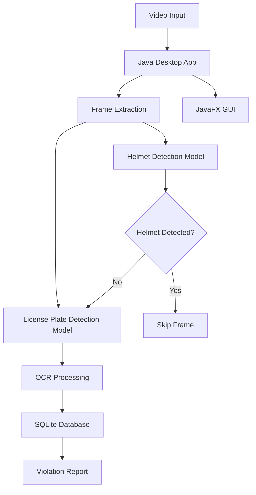

# 🛡️ RideSecure - Intelligent Helmet Detection System

> **A hybrid Java + Python application for automated motorcycle helmet compliance monitoring and license plate recognition**

[](https://opensource.org/licenses/MIT)
[](https://openjdk.java.net/)
[](https://www.python.org/)
[](https://openjfx.io/)

## 🎯 Project Overview

RideSecure is an intelligent computer vision system designed to automatically detect motorcycle riders without helmets from video footage, extract license plate information, and maintain comprehensive violation records. This prototype system combines the robustness of Java for desktop applications with the machine learning capabilities of Python.

### 🏗️ Architecture



### 🔧 Technology Stack

**Java Components:**
- **GUI Framework:** JavaFX 17.0.2
- **Video Processing:** JavaCV (OpenCV bindings)
- **OCR Engine:** Tess4J (Tesseract wrapper)
- **Database:** SQLite with JDBC
- **ML Runtime:** ONNX Runtime for Java
- **Build Tool:** Maven 3.8+

**Python Components:**
- **ML Framework:** PyTorch + Ultralytics YOLO v8
- **Computer Vision:** OpenCV
- **Model Export:** ONNX for interoperability
- **API Framework:** FastAPI (optional inference service)
- **Data Science:** NumPy, Pandas, Matplotlib

## 📁 Project Structure

```
RideSecure/
├── 📁 java/                          # Java Desktop Application
│   ├── 📄 pom.xml                   # Maven configuration
│   ├── 📁 src/
│   │   ├── 📁 main/java/com/ridesecure/
│   │   │   ├── 📄 RideSecureApp.java        # Main JavaFX application
│   │   │   ├── 📄 MainController.java       # Primary UI controller
│   │   │   ├── 📁 model/                    # Data models
│   │   │   ├── 📁 service/                  # Business logic
│   │   │   ├── 📁 detection/               # ML inference wrappers
│   │   │   ├── 📁 database/                # Database operations
│   │   │   └── 📁 utils/                   # Utility classes
│   │   ├── 📁 main/resources/
│   │   │   ├── 📄 application.fxml         # JavaFX UI layouts
│   │   │   └── 📁 css/                     # Styling
│   │   └── 📁 test/java/                   # Java unit tests
│   └── 📄 README.md                        # Java module docs
├── 📁 python/                        # Python ML Components  
│   ├── 📄 pyproject.toml            # Python project config
│   ├── 📁 src/ridesecure/
│   │   ├── 📄 __init__.py
│   │   ├── 📁 training/              # Model training scripts
│   │   ├── 📁 inference/             # ONNX export & API service
│   │   ├── 📁 data/                  # Data processing utilities
│   │   └── 📁 models/                # Model architectures
│   ├── 📁 notebooks/                 # Jupyter training notebooks
│   ├── 📁 tests/                     # Python unit tests
│   └── 📄 README.md                  # Python module docs
├── 📁 models/                        # Exported ML Models
│   ├── 📁 onnx/                      # Production ONNX models
│   │   ├── 📄 helmet_yolo_v8.onnx
│   │   └── 📄 plate_detection_yolo_v8.onnx
│   └── 📁 pytorch/                   # PyTorch checkpoints
├── 📁 data/                          # Training & Test Data
│   ├── 📁 videos/
│   │   └── 📁 sample/                # Sample test videos
│   └── 📁 training/
│       ├── 📁 helmet_detection/      # Helmet dataset
│       └── 📁 license_plate/         # License plate dataset
├── 📁 database/                      # Database Components
│   ├── 📁 schema/
│   │   └── 📄 init.sql              # Database initialization
│   └── 📄 ridesecure.db            # SQLite database file
├── 📁 output/                        # Generated Outputs
│   ├── 📁 snapshots/                # Violation screenshots
│   ├── 📁 reports/                   # Generated reports
│   └── 📁 logs/                      # Application logs
├── 📁 config/                        # Configuration Files
│   ├── 📄 application.yml           # Main app configuration
│   └── 📁 tessdata/                 # Tesseract OCR data
├── 📁 docs/                          # Documentation
├── 📁 .github/workflows/            # CI/CD pipelines
├── 📄 docker-compose.yml            # Container orchestration
├── 📄 .gitignore                    # Git ignore rules
└── 📄 README.md                     # This file
```

## 🚀 Quick Start

### Prerequisites

- **Java 11+** (OpenJDK recommended)
- **Python 3.8+** with pip
- **Maven 3.6+**
- **Git** for version control
- **CUDA** (optional, for GPU acceleration)

### 1. Clone Repository

```bash
git clone https://github.com/singharyan006/ride-secure.git
cd ride-secure
```

### 2. Setup Python Environment

```bash
cd python
pip install -e .
# For development
pip install -e .[dev]
# For GPU support
pip install -e .[gpu]
```

### 3. Setup Java Application

```bash
cd ../java
mvn clean compile
mvn javafx:run
```

### 4. Initialize Database

```bash
cd ../database
sqlite3 ridesecure.db < schema/init.sql
```

### 5. Download Sample Data

```bash
# Download sample videos to data/videos/sample/
# Download pre-trained models to models/onnx/
```

## 🔄 Workflow

### Prototype Stage Process

1. **Video Loading**: JavaFX application loads test videos from `data/videos/`
2. **Frame Processing**: Each frame is analyzed for helmet violations
3. **Helmet Detection**: YOLO model identifies riders and helmet status
4. **Violation Detection**: Frames with no-helmet riders trigger license plate detection
5. **License Plate Recognition**: 
   - YOLO detects license plate regions
   - Tesseract OCR extracts plate numbers
6. **Database Logging**: Violations stored in SQLite with timestamps and snapshots
7. **GUI Display**: Real-time visualization with bounding boxes and violation table

### Detection Pipeline

```python
# Simplified detection flow
for frame in video_frames:
    riders = helmet_detection_model.detect(frame)
    
    for rider in riders:
        if not rider.has_helmet and rider.confidence > threshold:
            plate_region = license_plate_model.detect(frame, rider.bbox)
            
            if plate_region:
                plate_text = tesseract_ocr.extract_text(plate_region)
                save_violation(frame, rider, plate_text, timestamp)
```

## 🏃‍♂️ Running the Application

### Development Mode

```bash
# Start Python inference service (optional)
cd python
python -m uvicorn src.ridesecure.inference.api:app --reload --host 0.0.0.0 --port 8000

# Run Java desktop application
cd java
mvn javafx:run
```

### Production Mode

```bash
# Using Docker Compose
docker-compose up -d

# Or build standalone JAR
cd java
mvn clean package
java -jar target/ridesecure-desktop-1.0.0-SNAPSHOT.jar
```

## 🧪 Model Training

### Helmet Detection

```bash
cd python/notebooks
jupyter notebook helmet_detection_training.ipynb

# Or via command line
cd python
python -m ridesecure.training.train_helmet_model \
    --data data/training/helmet_detection \
    --epochs 100 \
    --batch-size 16
```

### License Plate Detection

```bash
python -m ridesecure.training.train_plate_model \
    --data data/training/license_plate \
    --epochs 50 \
    --batch-size 8
```

### Model Export

```bash
# Export trained models to ONNX format
python -m ridesecure.inference.export_models \
    --input models/pytorch/helmet_best.pt \
    --output models/onnx/helmet_yolo_v8.onnx
```

## 🏗️ Architecture Details

### Java Application Architecture

```
com.ridesecure/
├── RideSecureApp           # JavaFX Application entry point
├── controller/
│   ├── MainController      # Primary UI controller
│   └── SettingsController  # Configuration UI
├── model/
│   ├── Violation          # Violation data model
│   ├── DetectionResult    # Detection result wrapper
│   └── VideoFrame         # Frame processing model
├── service/
│   ├── VideoProcessor     # Video loading and frame extraction
│   ├── DetectionService   # ML model inference coordination
│   ├── DatabaseService    # SQLite operations
│   └── ReportGenerator    # Export and reporting
├── detection/
│   ├── HelmetDetector     # ONNX helmet detection wrapper
│   ├── PlateDetector      # ONNX plate detection wrapper
│   └── OCRProcessor       # Tesseract integration
└── utils/
    ├── ConfigManager      # Configuration loading
    ├── ImageUtils         # Image processing utilities
    └── FileUtils          # File operations
```

### Python ML Architecture

```
ridesecure/
├── training/
│   ├── helmet_trainer.py    # YOLO helmet detection training
│   ├── plate_trainer.py     # YOLO license plate training
│   └── data_augmentation.py # Data preprocessing
├── inference/
│   ├── onnx_exporter.py    # PyTorch to ONNX conversion
│   ├── api.py              # FastAPI inference service
│   └── batch_processor.py  # Batch video processing
├── models/
│   ├── yolo_helmet.py      # Custom YOLO architecture
│   └── yolo_plate.py       # Plate detection model
└── data/
    ├── dataset_loader.py   # Training data pipeline
    └── video_processor.py  # Video frame extraction
```

## 📊 Database Schema

### Core Tables

- **violations**: Main violation records with detection metadata
- **detection_sessions**: Video processing session tracking
- **model_performance**: ML model accuracy metrics

### Key Features

- Automatic timestamp tracking
- Indexed searching by license plate and timestamp
- Session-based processing for batch operations
- Model performance monitoring

## ⚙️ Configuration

### Application Settings (`config/application.yml`)

```yaml
# Key configuration options
models:
  helmet_detection:
    confidence_threshold: 0.7    # Adjust based on model accuracy
    
detection:
  helmet_violation_threshold: 0.8  # Certainty level for violations
  min_detection_duration_frames: 5 # Avoid false positives
```

### Model Configuration

- **Confidence Thresholds**: Adjust based on model performance vs false positives
- **NMS Thresholds**: Fine-tune for overlapping detections
- **Input Sizes**: Match training resolution for optimal accuracy

## 🧪 Testing

### Java Unit Tests

```bash
cd java
mvn test
```

### Python Tests

```bash
cd python
pytest tests/ -v --cov=ridesecure
```

### Integration Testing

```bash
# End-to-end test with sample video
python python/tests/test_integration.py
```

## 📈 Performance Optimization

### Hardware Recommendations

- **CPU**: Intel i5-8400 / AMD Ryzen 5 2600 or better
- **RAM**: 8GB minimum, 16GB recommended
- **GPU**: NVIDIA GTX 1060 or better (for GPU acceleration)
- **Storage**: SSD recommended for video processing

### Optimization Tips

1. **Batch Processing**: Process multiple frames together for efficiency
2. **Frame Skipping**: Skip frames during low-motion periods
3. **Model Quantization**: Use INT8 ONNX models for faster inference
4. **Caching**: Cache detection results for replay scenarios

## 🚀 Deployment Options

### Desktop Deployment

```bash
# Create executable JAR
cd java
mvn clean package
# Distribute target/ridesecure-desktop-1.0.0-SNAPSHOT.jar
```

### Docker Deployment

```bash
# Multi-service deployment
docker-compose up -d
```

### Cloud Deployment

- **AWS**: EC2 with GPU instances for inference service
- **Google Cloud**: Compute Engine with TPU support
- **Azure**: VM with GPU for real-time processing

## 🔧 Development Guidelines

### Code Style

- **Java**: Follow Google Java Style Guide
- **Python**: Follow PEP 8, enforced with Black formatter
- **Commits**: Use Conventional Commits format

### Contributing

We welcome contributions from the community! Please read our [Contributing Guidelines](CONTRIBUTING.md) for detailed information on:

- **Development Setup**: Environment configuration for Java + Python
- **Coding Standards**: Style guides and best practices
- **Testing Requirements**: Unit, integration, and coverage guidelines  
- **Pull Request Process**: Step-by-step contribution workflow
- **Issue Guidelines**: Bug reports and feature requests

**Quick Start for Contributors:**
1. Fork the repository and clone locally
2. Read [CONTRIBUTING.md](CONTRIBUTING.md) for detailed setup
3. Create feature branch (`git checkout -b feature/amazing-feature`)
4. Follow coding standards and add tests
5. Run quality checks (`mvn test` and `pytest --cov`)
6. Submit Pull Request with proper description

## 📋 Roadmap

### Phase 1: Prototype (Current)
- [x] Basic helmet detection with YOLO
- [x] License plate OCR with Tesseract
- [x] SQLite violation logging
- [x] JavaFX desktop interface

### Phase 2: Enhancement
- [ ] Real-time camera integration
- [ ] Advanced OCR with deep learning
- [ ] Multi-camera support
- [ ] Web-based dashboard

### Phase 3: Production
- [ ] Edge device deployment
- [ ] Cloud integration
- [ ] Advanced analytics
- [ ] Mobile application

## 🛠️ Troubleshooting

### Common Issues

**JavaFX Module Path Issues**
```bash
# Add to JVM args:
--module-path /path/to/javafx/lib --add-modules javafx.controls,javafx.fxml
```

**Python CUDA Issues**
```bash
# Verify CUDA installation:
python -c "import torch; print(torch.cuda.is_available())"
```

**SQLite Permissions**
```bash
# Fix database permissions:
chmod 664 database/ridesecure.db
```

**Model Loading Errors**
- Ensure ONNX models are in `models/onnx/` directory
- Verify model file integrity with ONNX tools
- Check configuration paths in `config/application.yml`

## 🤝 Contributing

We encourage contributions from developers, researchers, and domain experts! See our [Contributing Guidelines](CONTRIBUTING.md) for:

- Development environment setup
- Coding standards and best practices
- Testing requirements and guidelines
- Pull request and review process
- Community guidelines and support

For first-time contributors, look for issues labeled `good first issue` in our [GitHub Issues](https://github.com/singharyan006/ride-secure/issues).

## 📄 License

This project is licensed under the MIT License - see the [LICENSE](LICENSE) file for details.

By contributing to this project, you agree that your contributions will be licensed under the same MIT License.

## 🤝 Acknowledgments

- **Ultralytics YOLO** for object detection framework
- **OpenCV** for computer vision utilities
- **Tesseract OCR** for text recognition
- **JavaFX** for desktop UI framework
- **FastAPI** for efficient Python web services

## 📞 Support

- **Issues**: [GitHub Issues](https://github.com/singharyan006/ride-secure/issues)
- **Discussions**: [GitHub Discussions](https://github.com/singharyan006/ride-secure/discussions)
- **Email**: ridesecure.support@example.com

---

**Built with ❤️ for road safety and traffic compliance automation**